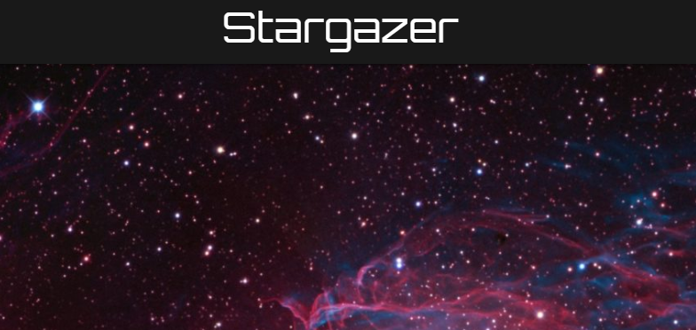
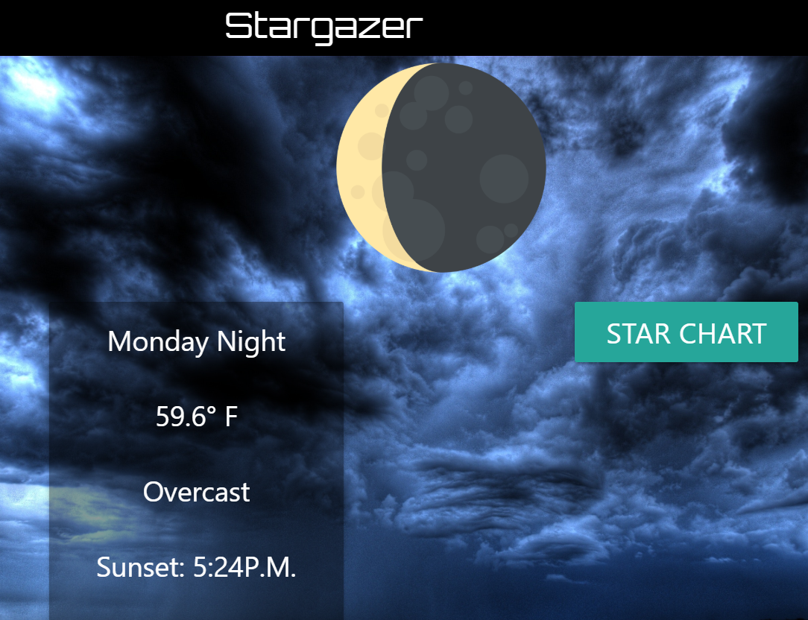
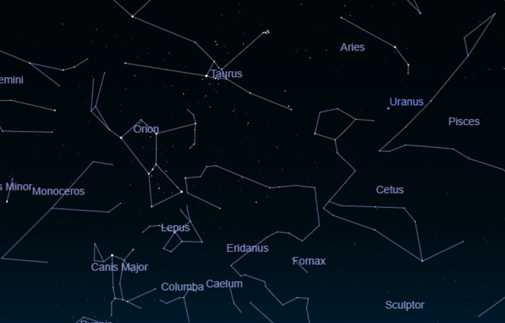

# projectone
Title: Stargazer

Introduction: Stargazers rejoice!  This project is a web-based application created to provide star-gazing enthusiasts with a one-stop resourse that provides current and forcasted conditions for temperature, meteorological clarity, moon phases, and visible constellations for any city searched by the user.

Upon launching this page, the user is greated with a stunning celestial image spanning most of the page.  The web application provides a prompt requesting permission to access the user's latitude and longitude.  Upon approval of this request the current city location is displayed within the menu bar to the left and below the city name a list of the proceeding seven evenings is available for selection.  The user may, alternatively, search for any desired city location.  When one of the forcasted nights is clicked, a detailed forcast of meteorological conditions appears. The forcast includes an icon representing the respective moon phase, the temperature, as well as the level of anticipated cloud cover.  The background image for this forcast will change and is determined by conditions of clear, partly cloudy, and cloudy.  

At the bottom of each of these forcasts there is a button called "Star Charts".  Upon clicking this button, another full-screen image appears that is a virtual representation of the constellations visible from the searched location.

Technology: This website utilizes html, css, Materialize css, javascript, and jquery.  It also accesses api information from the following websites:

opencagedata.com
ipgeolocation.io
virtualsky.ico
darksky.net

This project was created by the following collaborators:

Kody Bishop
James Hamilton
Lynn O'Neill

Launch: This website can be launched in a browser.

Instructions for use:  If another developer would like to clone this project, they will need to obtain api keys from the websites listed above.

